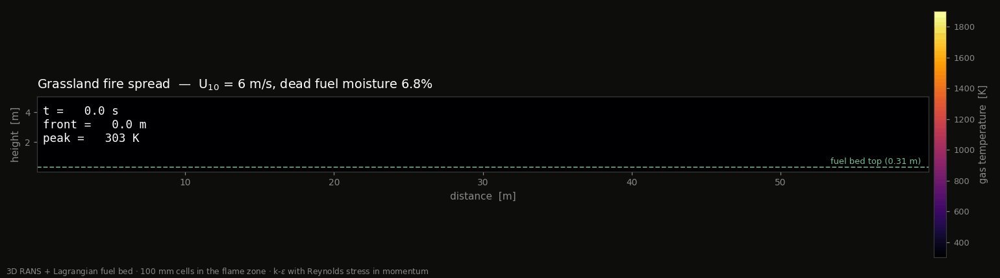
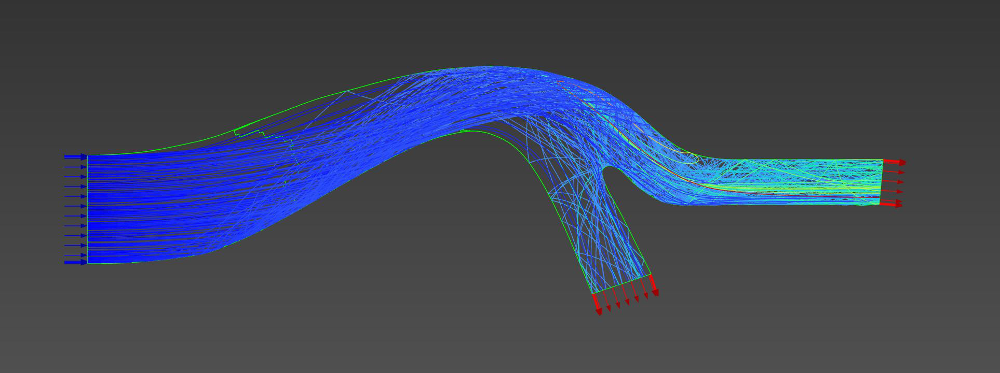

# Portfolio

Public-facing documentation for my modelling work. Source code lives in
private repositories; what is published here is model description,
methodology and validation results.

## Projects

### [FireModel](firemodel/) — three-dimensional fire spread solver

A reacting-flow model of fire spread through a porous fuel bed, with a
particle-resolved bed and a level-set fire front, built as a
pre-suppression baseline for testing fire suppression devices.

- [Model description](firemodel/README.md) — physics, numerics,
  working practice, work to come
- [Cheney 1993 grassland fires](firemodel/cheney_1993/README.md) —
  validation case

### [Inlet protection systems](ips/) — Lagrangian particle tracking, wall rebound models

One-way coupled Eulerian–Lagrangian modelling of sand ingestion in a
two-dimensional inertial particle separator, comparing empirical,
impulse-based and rough-wall particle rebound models against measured
scavenge efficiency.

- [Wall rebound models and 2D IPS comparison](ips/README.md)

## Licence

Text, figures and animations in this repository that are my own work are
released under [CC BY 4.0](LICENSE.md). Experimental data points shown
in figures belong to the cited authors and are reproduced for comparison
only.
