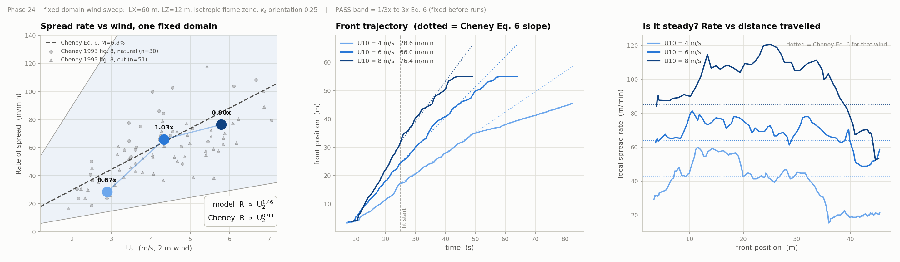

# Validation case: Cheney 1993 grassland fires

Validation of the three-dimensional [FireModel](../README.md) solver
against the grassland fire experiments of Cheney, Gould and Catchpole
(1993).


*Gas temperature in a vertical slice through the fire, natural grass,
10 m wind 6 m/s, dead fuel moisture 6.8%. 100 mm cells in the flame
zone.*

## Experiment

Cheney, Gould and Catchpole (1993) measured head-fire rate of spread in
experimental grassland fires at Annaburroo, Northern Territory, in
natural and cut pasture, against wind speed, fuel moisture and fuel
condition. Their Eq. 6 fits the natural-pasture data:

```
R = 0.406 · U₂^0.987 · exp(−0.0707 · M)
```

with R in m/s, U₂ the wind speed at 2 m in m/s, and M the dead fuel
moisture in percent, fitted over U₂ from 2 to 7 m/s. The model takes a
10 m wind and converts with U₂ = 0.723 U₁₀.

Reference: Cheney, N. P., Gould, J. S., Catchpole, W. R. (1993).
*International Journal of Wildland Fire* 3(1), 31–44. Figure 8 of the
paper was digitised for the comparison (30 natural and 51 cut points),
with no rescaling, shifting or clipping.

## Case definition

Undisturbed *Eriachne* pasture, the natural-grass treatment.

| Parameter | Value | Source |
|---|---|---|
| Fuel bed height | 0.31 m | Cheney 1993, Table 3 |
| Bulk density | 1.25 kg/m³ | Cheney 1993, Table 3 |
| Fuel load | 0.388 kg/m² | product of the two above |
| Surface-area-to-volume ratio | 9770 m⁻¹ | Cheney 1993, text, undisturbed *Eriachne* |
| Dead fuel moisture | 6.8 % | Cheney 1993, natural-grass mean |
| Wind at 10 m | 4, 6, 8 m/s | U₂ = 2.9, 4.3, 5.8 m/s |

Numerical setup, identical for all three winds:

| Setting | Value |
|---|---|
| Domain | 60 m long, 12 m high, one cell wide (infinite fireline) |
| Cell size | 100 mm in the flame zone, stretched above |
| Turbulence | k-epsilon with Reynolds stress in momentum |
| Combustion | Eddy Dissipation Concept |
| Radiation | discrete ordinates |
| Fuel bed | Lagrangian particles: drying, pyrolysis, char oxidation |
| Ignition | line igniter at the upwind end, then off |


## Acceptance

Fixed before the runs:

```
1/3  ≤  R_model / R_Eq6  ≤  3
```


## Result



| U₁₀ (m/s) | U₂ (m/s) | Model (m/min) | Eq. 6 (m/min) | Ratio | In band |
|---|---|---|---|---|---|
| 4 | 2.9 | 28.6 | 43.0 | 0.67 | yes |
| 6 | 4.3 | 66.0 | 64.1 | 1.03 | yes |
| 8 | 5.8 | 76.4 | 85.2 | 0.90 | yes |

All three winds fall inside the band. The model spread rate scales as
U₂ to the power 1.46 over the three points, against 0.99 in the
experiment.

The right-hand panel shows local spread rate against front position. At
6 and 8 m/s the rate oscillates about its mean with a period of 7 to
9 s. At 4 m/s the rate drops after about 35 m of travel.

## Known limitations

- Below roughly 1.5 m/s the resolved physics does not sustain
  propagation. 

## Work to come


