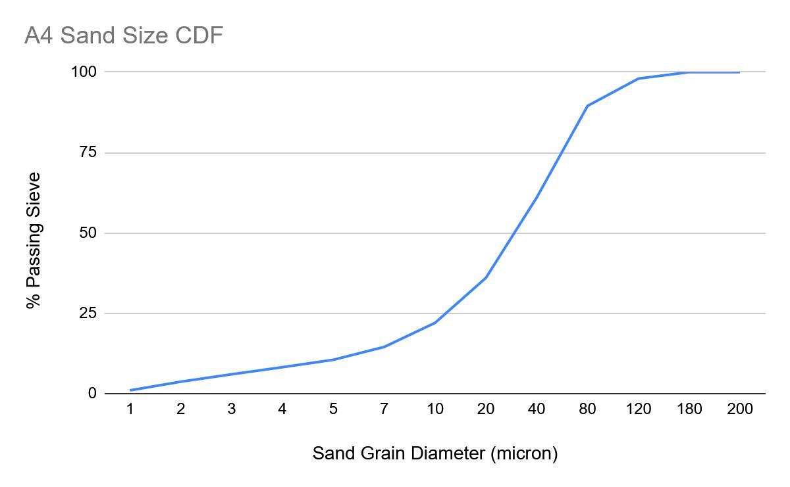
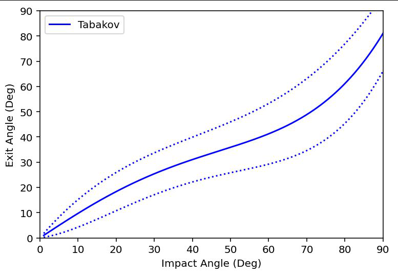
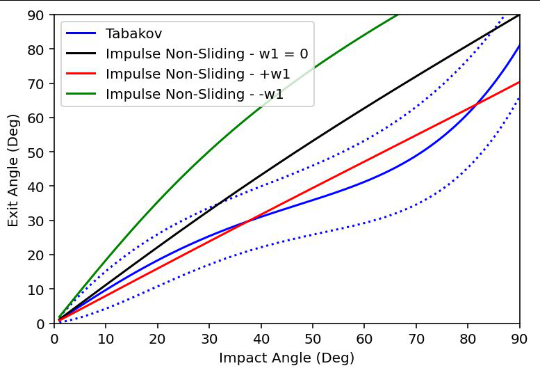
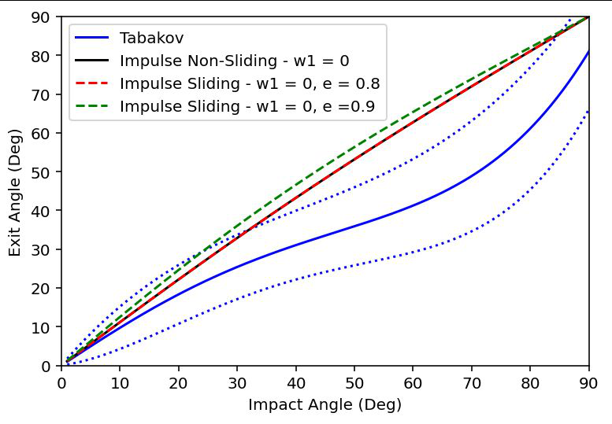
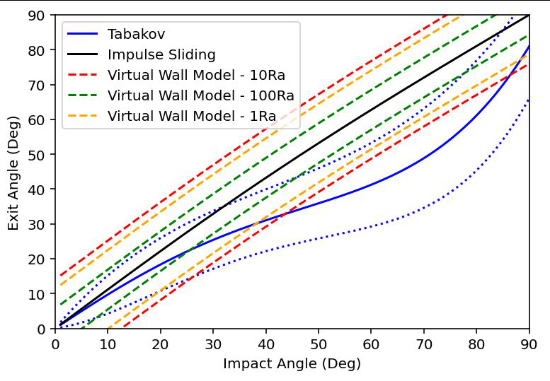

# Inlet protection systems — Lagrangian particle tracking and wall rebound models

One-way coupled Eulerian–Lagrangian modelling of sand ingestion through
an aircraft engine inlet protection system (IPS), with the particle–wall
rebound treated at three levels of physics and compared on a
two-dimensional inertial particle separator. Presented April 2025.

*Sand particle tracks through the Barone et al. (2012) two-dimensional
inertial particle separator. Inflow at left, scavenge duct below, core
duct at right.*

## Modelling approach

| | |
|---|---|
| Fluid phase | Steady compressible RANS, pressure-based, k-omega SST |
| Particle phase | Lagrangian, one-way coupled, no particle–particle interaction |
| Size distribution | Polydisperse, tabulated A4 test sand, 43.5 µm mean |
| Injection | 10 000 parcels across the inlet, spherical drag, particle rotation carried |
| Wall interaction | Empirical, impulse-based, and rough-wall rebound models |
| Solver | ANSYS Fluent, 2D double precision |

## Wall rebound models

### Empirical: Grant and Tabakoff (1975)

Least-squares polynomial fits of restitution ratios in impact angle
$\beta_1$, with a fitted standard deviation about each mean:

$$
\frac{V_{n,2}}{V_{n,1}} = 0.993 - 1.76\beta_1 + 1.56\beta_1^{2} - 0.49\beta_1^{3}
$$

$$
\frac{V_{t,2}}{V_{t,1}} = 0.988 - 1.66\beta_1 + 2.11\beta_1^{2} - 0.67\beta_1^{3}
$$

$$
\sigma\left(\frac{V_{n,2}}{V_{n,1}}\right) = 2.15\beta_1 - 5.02\beta_1^{2} + 4.05\beta_1^{3} - 1.085\beta_1^{4}, \qquad \sigma\left(\frac{V_{t,2}}{V_{t,1}}\right) = -0.0005 + 0.62\beta_1 - 0.535\beta_1^{2} + 0.089\beta_1^{3}
$$

### Impulse-based, non-sliding: Matsumoto and Saito (1970), Tsuji et al. (1987)

Hard sphere on a smooth wall, normal restitution $e$, no slip at the
contact point. Post-impact normal velocity, tangential velocity and
spin:

$$
v_2 = -e v_1, \qquad u_2 = \tfrac{1}{7}\left(5u_1 + D\omega_1\right), \qquad \omega_2 = \frac{2u_2}{D}
$$

### Impulse-based, sliding extension: Tsuji et al. (1987)

Non-sliding branch applies when the contact-point tangential velocity
is below the friction limit:

$$
\left| u_1 - \tfrac{D}{2}\omega_1 \right| < \tfrac{7}{2}\mu_0 (1+e) v_1
$$

Otherwise the particle slides through contact, with friction
coefficient $\mu$:

$$
u_2 = u_1 - \mu(1+e) v_1 \epsilon_0, \qquad v_2 = -e v_1, \qquad \omega_2 = \omega_1 + 5\mu(1+e)\frac{v_1}{D}\epsilon_0, \qquad \epsilon_0 = \operatorname{sign}\left(u_1 - \tfrac{D}{2}\omega_1\right)
$$

### Rough wall: Sommerfeld and Huber (1999)

Wall roughness enters as a random tilt $\Delta\gamma$ of the local wall
normal, sampled from a normal distribution about the nominal wall angle.
The tilt scale depends on whether the particle is smaller or larger than
the roughness peak spacing $RS_m$:

$$
\Delta\gamma = \operatorname{atan}\left(\frac{2R_a}{RS_m}\right) \quad \text{if} \quad D < \frac{RS_m}{\sin\left(\operatorname{atan}(2R_a/RS_m)\right)}, \qquad \Delta\gamma = \operatorname{atan}\left(\frac{2R_q}{RS_m}\right) \quad \text{otherwise}
$$

with $R_a$ the average roughness and $R_q$ its standard deviation.
Shadow effect: sampled wall tilts that would present a negative angle
larger than the approach angle are rejected and resampled.

Roughness values used, for a 200 µm particle:

| Surface finish | $R_a$ (µm) | $R_q$ (µm) | $RS_m$ (µm) |
|---|---|---|---|
| Cutting | 100 | 25 | 50 |
| Casting | 25 | 1 | 10 |
| Polishing | 1 | 0.05 | 0.5 |

## Comparison: 2D inertial particle separator

Case from Barone, Loth and Snyder (2012). A4 sand, 1.71 lbm/s core
flow, 0.428 lbm/s scavenge flow, 20 % scavenge ratio.

| Rebound model | Scavenge efficiency |
|---|---|
| Measured, Barone et al. (2012) | 88 % |
| Tabakoff | 96.2 % |
| Impulse, sliding | 95.3 % |
| Rough wall, $R_a$ = 100 µm | 73.4 % |
| Rough wall, $R_a$ = 25 µm | 62.3 % |
| Rough wall, $R_a$ = 1 µm | 82.2 % |

## Work to come

- Non-spherical particles: impact angle becomes a function of particle
  orientation and surface; high-friction sliding and rolling contacts
  can leave the wall.
- Erosion: impact angle coupled to the evolving surface; transient
  treatment.

## References

- Barone, D., Loth, E., Snyder, P. (2012). A 2-D inertial particle
  separator research facility. *28th AIAA Aerodynamic Measurement
  Technology, Ground Testing, and Flight Testing Conference*.
- Grant, G., Tabakoff, W. (1975). Erosion prediction in turbomachinery
  resulting from environmental solid particles. *Journal of Aircraft*
  12(5), 471–478.
- Sommerfeld, M., Huber, N. (1999). Experimental analysis and modelling
  of particle-wall collisions. *International Journal of Multiphase
  Flow* 25, 1457–1489.
- Sommerfeld, M. (1992). Modelling of particle-wall collisions in
  confined gas-particle flows. *International Journal of Multiphase
  Flow* 18(6), 905–926.
- Tsuji, Y., Morikawa, Y., Tanaka, T., Nakatsukasa, N., Nakatani, M.
  (1987). Numerical simulation of gas-solid two-phase flow in a
  two-dimensional horizontal channel. *International Journal of
  Multiphase Flow* 13(5), 671–684.
- Matsumoto, S., Saito, S. (1970). On the mechanism of suspension of
  particles in horizontal pneumatic conveying: Monte Carlo simulation
  based on the irregular bouncing model. *Journal of Chemical
  Engineering of Japan* 3(1), 83–92.
- Stallard, P. (1997). Helicopter engine protection. *Perfusion* 12,
  263–267.
- Filippone, A., Bojdo, N. (2011). Helicopter engine intake barrier
  filter design. *37th European Rotorcraft Forum*.
